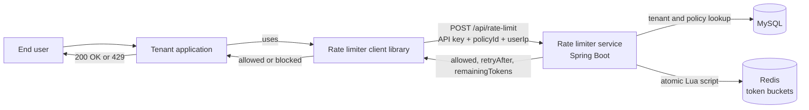

# Rate Limiter as a Service

A multi-tenant rate-limiting service built with **Java 21, Spring Boot, Redis and MySQL**, plus a small **Java client library** that applications use to ask the service "is this request allowed?".

Tenants register once, receive an API key, and define their own limits (policies). Their applications then call the service for every incoming request and either let it through or answer with **HTTP 429 Too Many Requests**.

---

## Table of contents

- [Features](#features)
- [How it works](#how-it-works)
- [Tech stack](#tech-stack)
- [Getting started](#getting-started)
- [API reference](#api-reference)
- [Using the Java client library](#using-the-java-client-library)
- [Design decisions](#design-decisions)
- [Security](#security)
- [Performance](#performance)
- [Project structure](#project-structure)
- [Roadmap](#roadmap)
- [Author](#author)

---

## Features

- **Token bucket algorithm** with a configurable capacity and refill rate per policy.
- **Atomic checks in Redis** using a Lua script, so concurrent requests can never read the same token.
- **Multi-tenant**: every tenant has its own API key and its own policies. Buckets are keyed by `tenantId:policyId:userIp`, so tenants can never share or affect each other's limits.
- **Helpful responses**: every answer includes whether the request is allowed, the remaining tokens, and how many seconds to wait (`retryAfter`).
- **Reusable Java client library** with configurable timeouts and a fail-open / fail-closed option, so a rate limiter problem never takes down the tenant's application.
- **Secure by default**: BCrypt-hashed passwords, hashed API keys, input validation, and a consistent JSON error format.
- **Fails fast**: short Redis timeouts mean the service answers with `503` quickly instead of hanging when Redis is down.

---

## How it works



1. A user calls the tenant's application.
2. The tenant's application asks the rate limiter (through the client library) whether this user may continue.
3. The service identifies the tenant from the API key, loads the policy, and runs the token bucket script in Redis.
4. The service answers with `allowed`, `remainingTokens` and `retryAfter`.
5. The tenant lets the request through, or returns **HTTP 429**.

### The token bucket in one paragraph

Each user has a bucket that holds up to `capacity` tokens and starts full. Each request uses one token. Tokens are added back at `refillRate` tokens per second, but never above the capacity. If the bucket is empty, the request is blocked and the service says how many seconds to wait. This allows short bursts while keeping the long-term rate under control.

---

## Tech stack

| Area | Technology |
|---|---|
| Language | Java 21 |
| Framework | Spring Boot 4 (Spring Web MVC, Spring Data JPA, Spring Data Redis) |
| Rate limit state | Redis, with a Lua script |
| Tenant and policy data | MySQL 8 |
| Client library | Java `HttpClient`, Jackson |
| Password hashing | BCrypt (`spring-security-crypto`) |
| Load testing | Apache JMeter |
| Build tool | Maven |

---

## Getting started

### Prerequisites

- Java 21
- Maven
- MySQL 8 running locally
- Redis running locally (default port 6379)

### 1. Clone the repository

```bash
git clone https://github.com/<your-username>/<your-repo>.git
cd <your-repo>
```

### 2. Create the database

```sql
CREATE DATABASE rate_limiter_db;
```

The tables are created automatically on the first start.

### 3. Configure your secrets

Copy the example file and fill in your own values. **Never commit the real `.env` file.**

```bash
cp .env.example .env
```

```
DB_USERNAME=your-mysql-user
DB_PASSWORD=change-me
REDIS_PASSWORD=
```

The settings that matter for failing fast when Redis is down are in `application.properties`:

```
spring.data.redis.timeout=300ms
spring.data.redis.connect-timeout=1s
```

### 4. Run the service

```bash
mvn spring-boot:run
```

The service starts on `http://localhost:8080`.

---

## API reference

### Register a tenant

`POST /api/register`

```json
{
  "companyName": "Acme Inc",
  "companyEmail": "team@acme.com",
  "password": "a-strong-password"
}
```

Response `201 Created`:

```json
{
  "status": "active",
  "createdAt": "2026-10-09T01:00:00",
  "apiKey": "rl_live_..."
}
```

> **Copy the API key immediately.** Only a hash of it is stored, so it can never be shown again.

### Check a request against a policy

`POST /api/rate-limit`

Headers:

```
Authorization: <your API key>
Content-Type: application/json
```

Body:

```json
{
  "policyId": "5c2bdc90-5ac6-4bb7-b68d-8f845c88df0e",
  "userIp": "203.0.113.5"
}
```

Response `200 OK` (request allowed):

```json
{
  "allowed": true,
  "limit": 10,
  "message": "Allowed",
  "policyId": "5c2bdc90-5ac6-4bb7-b68d-8f845c88df0e",
  "remainingTokens": 9,
  "retryAfter": 0.0
}
```

Response `200 OK` (request blocked, the tenant should answer with HTTP 429):

```json
{
  "allowed": false,
  "limit": 10,
  "message": "Rate Limit Exceeded",
  "policyId": "5c2bdc90-5ac6-4bb7-b68d-8f845c88df0e",
  "remainingTokens": 0,
  "retryAfter": 8.0
}
```

`retryAfter` is the number of seconds until the next token is available.

### Error responses

All errors use the same JSON shape:

```json
{ "error": "Unauthorized", "message": "Invalid or missing API key" }
```

| Status | Meaning |
|---|---|
| `400 Bad Request` | Missing or invalid input (for example no `userIp`, or an invalid policy id) |
| `401 Unauthorized` | Missing or invalid API key |
| `403 Forbidden` | The tenant exists but is not active |
| `404 Not Found` | The policy does not exist for this tenant |
| `409 Conflict` | A tenant with this email already exists |
| `503 Service Unavailable` | Redis or the database is unavailable |

---

## Using the Java client library

The client library lives in its own module / repository so tenants can add it to their own applications.

### Add the dependency

```xml
<dependency>
    <groupId>com.ayush</groupId>
    <artifactId>rate-limiter-client</artifactId>
    <version>1.0.0</version>
</dependency>
```

> The coordinates above are placeholders. Replace them with the values from the library's `pom.xml`.

### Basic usage

```java
RateLimiterClient client = new RateLimiterClient("http://localhost:8080", "YOUR_API_KEY");

Response result = client.invokeRateLimit("YOUR_POLICY_ID", "203.0.113.5");

if (result.isAllowed()) {
    // let the request through
} else {
    // respond with HTTP 429 and a Retry-After header
}
```

Create **one** client when your application starts and reuse it for every request.

### Custom settings

```java
RateLimiterConfig config = new RateLimiterConfig();
config.setConnectTimeout(Duration.ofSeconds(2));
config.setRequestTimeout(Duration.ofMillis(800));
config.setFailOpen(false);   // block users if the rate limiter is unreachable

RateLimiterClient client = new RateLimiterClient("http://localhost:8080", "YOUR_API_KEY", config);
```

| Setting | Default | Meaning |
|---|---|---|
| `connectTimeout` | 1 second | How long to wait while connecting |
| `requestTimeout` | 500 ms | How long to wait for the answer |
| `failOpen` | `true` | If the service is slow or down: `true` allows the request, `false` blocks it |

`invokeRateLimit` never throws. If the service cannot be reached, the library returns a fallback answer according to `failOpen`, so a rate limiter outage cannot break the tenant's application.

---

## Design decisions

**Why Redis with a Lua script?**
A token bucket needs three steps: read the tokens, check them, subtract one. If two requests do this at the same time with separate commands, both can read the same value and both get through. Redis runs a Lua script as one uninterrupted unit, so the check is always correct, even with many servers or many concurrent requests.

**Why does Redis provide the clock?**
The script asks Redis for the current time (`TIME`) instead of using the application server's clock. If several backend servers run side by side, their clocks can differ slightly, and a single clock keeps refills consistent.

**Why throw away leftover time when the bucket is full?**
An early version carried unused refill time forward, which let extra requests through after an idle period. When the bucket is full the script now resets the refill time, so idle time can never be "saved up".

**Why fail-open by default in the library?**
A rate limiter should protect a tenant's system, not become the reason it goes down. If the service is unreachable, the default is to allow the request. Tenants who prefer to block can switch to fail-closed.

**Why short timeouts?**
A rate-limit check sits in front of every request, so waiting a long time for it would slow down the whole tenant application. Short timeouts keep a problem in the rate limiter from spreading.

---

## Security

- **Passwords** are stored as BCrypt hashes, never as plain text.
- **API keys** are random, are stored only as a SHA-256 hash plus a short hint for support, and are shown to the tenant once, at registration.
- **Tenant isolation**: policies are always looked up by policy id **and** tenant id, and bucket keys include the tenant id.
- **Input validation** on all request bodies, with clear `400` responses.
- **No internal details in errors**: stack traces and database messages are logged on the server and never returned to callers.
- Secrets are kept in environment settings (`.env` is git-ignored), not in the code.

---

## Performance

Load-tested with Apache JMeter on a single laptop, where the application, MySQL, Redis and JMeter all ran on the same machine.

**Setup:** 50 concurrent users, 5 second ramp-up, 30 seconds, warm run.

| Scenario | Throughput | p95 | p99 | Errors |
|---|---|---|---|---|
| One user IP | 7,701 req/s | 11 ms | 16 ms | 0% |
| Randomized user IPs | 7,590 req/s | 11 ms | 15 ms | 0% |

These numbers are **before** caching the API key and policy lookups, and are meant as a baseline. Because everything ran on one machine, compare them with each other, not with production figures.

<!-- TODO: add the "after caching" results here once the Caffeine cache is measured. -->

---

## Project structure

```
src/main/java/com/ayush/rateLimiterApp
├── rateLimiting            # controller, service, token bucket limiter, DTOs
├── tenantManagement        # tenant registration
├── apiCredentialManagement # API key storage
├── globalException         # consistent error responses
└── config                  # password encoder and other settings

src/main/resources
├── scripts/tokenBucket.lua # the atomic token bucket script
└── application.properties
```

---

## Roadmap

- [x] Token bucket in Redis with an atomic Lua script
- [x] Multi-tenant policies and API keys
- [x] Hashed passwords and hashed API keys
- [x] Validation and consistent error responses
- [x] Fast failure when Redis is down
- [x] Java client library with fail-open and configurable timeouts
- [x] Baseline load test with JMeter
- [ ] Cache API key and policy lookups, then re-measure
- [ ] Structured logging, health checks and metrics
- [ ] Automated tests (Lua script, library and API)
- [ ] Docker and Docker Compose setup
- [ ] CI with GitHub Actions
- [ ] Publish the client library and add a Spring Boot starter

---

## Author

**Ayush**
GitHub: [@ayushkr2706](https://github.com/ayushkr2706)